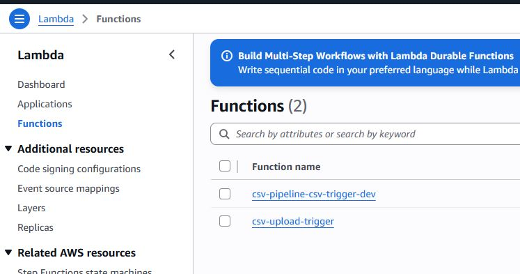
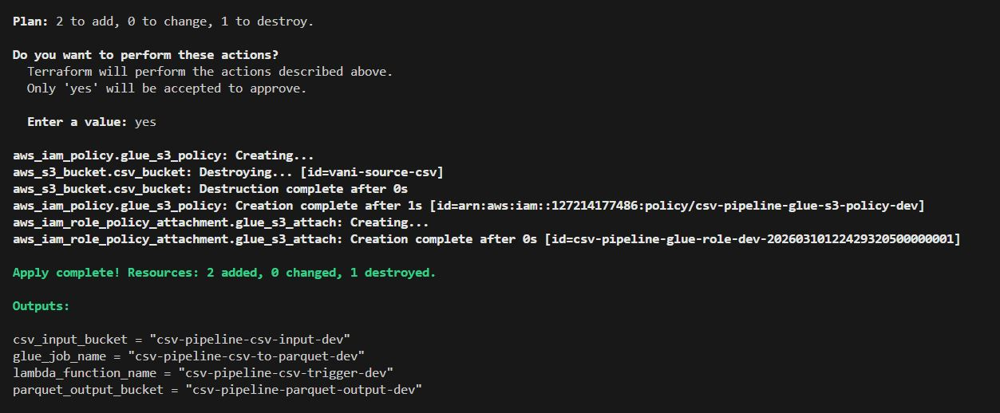

**Projet**: Transformation d'un fichier csv en parquet
**Description**: Ce projet a pour objectif de transformer un fichier csv en parquet en utilisant Terraform et AWS Glue. Nous allons créer une infrastructure sur AWS pour effectuer cette transformation de manière automatisée.
**Prérequis**:
- Un compte AWS
- Terraform installé sur votre machine
- AWS CLI installé et configuré
Étapes:
1. Créer un bucket S3 pour stocker le fichier csv et le fichier parquet.
2. Créer une table Glue pour le fichier csv.
3. Créer un job Glue pour transformer le fichier csv en parquet.
4. Exécuter le job Glue et vérifier que le fichier parquet est créé dans le bucket S3.
5. Nettoyer les ressources créées pour éviter des coûts inutiles.

# **Architecture du projet**

**bucket source**

**bucket destination**

**Glue job**

**Lambda**

**Terraform apply**

